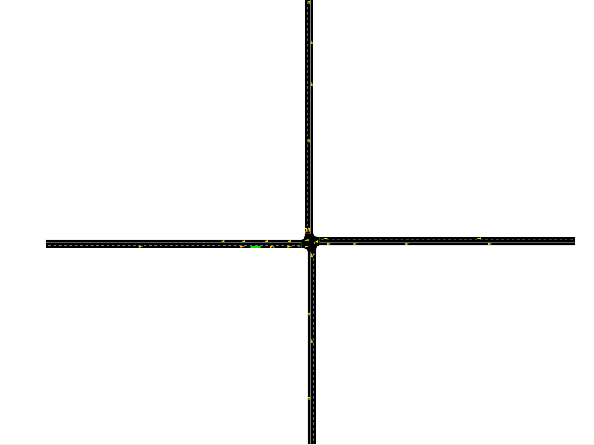

# first-sumo-simulation

> 用 Python 通过 TraCI 控制 SUMO 的红绿灯，跑完的数据用 pandas 清洗出图。



一条流水线，三站：**生成路网 → Python 控制仿真 → 清洗出图**。

自带一个手写的十字路口，clone 下来就能跑。**换成你自己的地方也是一条命令**——
喂它一个 OpenStreetMap 的 `.osm` 文件，它编译路网、生成车流、跑仿真、出图表。

信号控制器**不认识任何一条具体车道**：启动时它自己去问 SUMO，这个路口有几个信号灯、
每个几套相位、哪套相位给哪些车道放绿灯。所以它能用在任何有信号灯的路网上。

如果你是第一次接触 SUMO / TraCI，`1_connect.py` → `2_add_vehicles.py` →
`3_signal_control.py` 三个脚本由浅入深，每个都能独立跑通。踩过的坑都记在下面。

---

## 🌍 换成你自己的地方

这是这个仓库最实用的部分。三步：

```bash
# 1) 用你自己的地图建路网（--trips 顺便生成车流）
python scripts/build_from_osm.py --osm 你的地图.osm --trips

# 2) 跑仿真 + 出图（这一条命令全都干了）
python scripts/analyse_run.py --run-dir results/mine --simulate \
       --net-file net/你的地图.net.xml --route-file net/你的地图.rou.xml --end 3600

# 3) 想看画面就打开 SUMO 界面
sumo-gui -n net/你的地图.net.xml -r net/你的地图.rou.xml
```

**你的 `.osm` 文件从哪来？** 三种都行，脚本不关心：

| 来源 | 怎么做 |
|---|---|
| 网页导出 | [openstreetmap.org/export](https://www.openstreetmap.org/export) 框选区域 → 导出 |
| 命令行下载 | `python scripts/build_from_osm.py --bbox 116.47,39.87,116.49,39.88 --trips` |
| 现成数据包 | [Geofabrik](https://download.geofabrik.de/) 下载某个省/国家，再裁剪 |

> ⚠️ **在中国大陆，前两种方式基本都会失败。** 不是脚本的问题，是网络：
> `www.openstreetmap.org` 会被 DNS 污染（实测解析到 `157.240.0.35`，那是 Facebook 的 IP），
> 几个 Overpass 镜像要么连不上、要么**返回 200 加一份格式合法的空文档**——
> 这种"成功但为空"最坑，所以脚本会数一下文件里到底有没有路，没有就明说失败了。
>
> 用 VPN，或者让有网络的人帮你导出一份 `.osm` 发过来。**这条路 `--osm` 是完全离线的**，
> 只要文件在本地就能跑。

### 你的路网上也能控信号

`build_from_osm.py` 编译出来的路网，用 `--tls.guess` 让 netconvert 自己判断哪里该装红绿灯。
装好之后，感应控制器可以直接用：

```
python scripts/build_from_osm.py --osm 你的地图.osm --trips   # 编译（含信号灯）
# 然后在 Python 里：
from runner import run_simulation
run_simulation("results/mine", strategy="actuated",
               net_file="net/你的地图.net.xml",
               route_file="net/你的地图.rou.xml",
               drive_demand=False)      # 车流来自 .rou.xml，不由 Python 插
```

实测量级：一个 **202 个信号灯** 的真实城市路网，控制器 1.2 秒读完全部相位方案，
每仿真秒管 200 个路口。如果路网**一个信号灯都没有**，它会明确拒绝并告诉你原因，
而不是假装在工作。

---

## 🚦 这个项目能帮你做什么

SUMO 是一个开源的交通仿真软件，它自带的固定配时红绿灯很"听话"，但也仅此而已。
我好奇的是：**能不能用 Python 实时接管红绿灯？**

答案是可以，而且流程意外地简单：

```
手写三个 XML（节点、道路、连接）
        ↓  netconvert 编译
   一个十字路口路网
        ↓  traci.start() 启动 SUMO 并连接
   Python 一边看排队情况，一边改红绿灯
```

仓库里有三个脚本，难度一步比一步深，建议按顺序跑：

| 脚本 | 你会学到什么 |
|---|---|
| **`1_connect.py`** | 怎么连上 SUMO，能读到数据就算成功 |
| **`2_add_vehicles.py`** | 仿真跑着的时候往里塞车 |
| **`3_signal_control.py`** | 用 Python 代替固定配时，接管红绿灯 |

---

## 🔧 一条流水线，三站

整个仓库就是一条线，三站之间**只通过文件连接**：

```
① 生成路网                  ② Python 通过 TraCI 控制 SUMO        ③ 清洗出图
   generate_network.py         runner.run_simulation()             analyse_run.py
   build_from_osm.py           ├─ control.py   决定红绿灯          analyse_results.py
                               └─ demand.py    决定发车 / 删车
        ↓                              ↓                                ↓
   net/cross.net.xml            <run>/tripinfo.xml               metrics.csv
   net/real.net.xml             <run>/summary.xml                by_lane_queue.csv
                                <run>/queues.xml                 plot_*.png
```

第 ② 站写出来的 XML，和你手动 `sumo-gui` 跑出来的**一模一样**。
所以第 ③ 站不关心是谁开的车——人点的"播放"和 Python 驱动的仿真，它一视同仁。

### 第 ① 站 · 生成路网

| 脚本 | 产出 | 是什么 |
|---|---|---|
| `generate_network.py` | `net/cross.net.xml` | 手写 XML 的十字路口：8 条路 / 12 个连接 / 1 个信号灯 |
| `build_from_osm.py` | `net/real.net.xml` | 真实地图（OpenStreetMap），加 `--trips` 还能生成车流 |

> 📌 **编译出来的 `.net.xml` 不进仓库。**
>
> `net/cross.net.xml` 是**编译产物**：它由手写的 `net/cross.{nod,edg,con}.xml`
> 编译而来；`net/real.net.xml` 同理，来自 OpenStreetMap。
> 两个都能随时重建，而且 netconvert 每次编译都会往里写一个新的生成时间戳，
> 放进 git 只会制造无意义的 diff。
>
> **所以仓库里存的是"输入"，不是"输出"。** clone 下来只有那三个手写 XML。
>
> 不用担心少文件——**任何需要路网的脚本都会先自己检查，缺了就现编译**：
>
> ```
> $ python scripts/1_connect.py
> cross.net.xml is missing - compiling it from the hand-written XML
>   $ python .../scripts/generate_network.py
> ```
>
> 它是**明说**自己在干什么，不是偷偷补一个文件。


### 第 ② 站 · Python 控制 SUMO

| 脚本 | 干什么 |
|---|---|
| `1_connect.py` | 只连不干活，证明通道是通的 |
| `2_add_vehicles.py` | 运行时加车 + 把跑完的车删掉 |
| `3_signal_control.py` | 接管红绿灯，`--compare` 跟固定配时对比 |
| `run_experiments.py` | 批量跑：策略 × 需求档位 × 随机种子 |

三个共享模块，每样东西**只写一份**：

| 模块 | 管什么 |
|---|---|
| `control.py` | **决定**红绿灯。`fixed` / `actuated` 都在这里，加新策略只要加一个类 |
| `demand.py` | **决定**车流。按时刻表加车、把越过边界的车删掉 |
| `runner.py` | 把上面两件事和 SUMO 串起来，跑一次仿真。所有仿真都走这个入口 |

### 第 ③ 站 · 清洗出图

| 脚本 | 吃谁的数据 | 产出 |
|---|---|---|
| `analyse_run.py` | 一次仿真 | 指标表 + 4 个 CSV + 2 张图 |
| `analyse_results.py` | 一批仿真 | 策略对比表 + 对比图 |

两个脚本**共用同一套读取器**——`load_run` / `trip_metrics` / `network_metrics` /
`queue_metrics` 都定义在 `analyse_run.py` 里，`analyse_results.py` 直接 import。
所以"平均等待时间"只有一处定义，不会两边各算一个数。

---

## 🗺️ 两种路网：自己画的 vs 真实地图

上面那个十字路口是**手写 XML 画出来的**——结构简单、方便理解原理，但它是虚构的。

如果你想分析**某个真实地点**，用这个：

```bash
# 方式一：给一个经纬度范围，自动下载地图
python scripts/build_from_osm.py --bbox 116.470,39.875,116.485,39.888 --trips

# 方式二：用你自己从 openstreetmap.org 导出的 .osm 文件
python scripts/build_from_osm.py --osm map.osm --trips
```

它会做完三件事：

```
下载 / 读取 .osm 文件
        ↓  netconvert --osm-files
真实路网（车道数、路口形状都来自实际地图）
        ↓  randomTrips.py
车流文件（随机生成，可跑）
```

**实测效果**（用 SUMO 自带的德国某区域地图）：

| | 手写十字路口 | 真实地图 |
|---|---|---|
| 道路数 | 8 | **6,961** |
| 路口数 | 5 | **3,457** |
| 信号灯 | 1 | **199** |

建好之后直接跑：

```bash
sumo-gui -n net/real.net.xml -r net/real.net.rou.xml
```

> ⚠️ **踩过的坑**：`netconvert` 的 `--tls.guess.threshold` 参数和 `--tls.guess` 一起用会生成**损坏的路网**（信号灯定义重复，SUMO 拒绝加载）。所以脚本只用 `--tls.guess`。
>
> 而且 `netconvert` **会成功退出但写出坏文件**。所以脚本里加了"冒烟测试"——生成完立刻让 SUMO 加载一次，加载不了就报错。**别只看 netconvert 返回 0 就以为成功了。**

> 📌 OSM 数据是 ODbL 协议，写报告时要注明 **© OpenStreetMap contributors**。

---

## 🚀 五分钟跑起来

### 第一步：装 SUMO

去 [SUMO 官网](https://sumo.dlr.de/docs/Installing.html)下载安装，然后设一个环境变量：

```powershell
setx SUMO_HOME "C:\Program Files (x86)\Eclipse\Sumo"
```

> 💡 忘了设也没关系——脚本会自己去几个常见路径找 SUMO，
> 找不到时会打印提示告诉你怎么办。

### 第二步：克隆并运行

```bash
git clone https://github.com/kely6669/first-sumo-simulation.git
cd first-sumo-simulation

python scripts/generate_network.py             # 生成路网
python scripts/1_connect.py                    # 连上看看
python scripts/2_add_vehicles.py               # 加车跑起来
python scripts/3_signal_control.py --compare   # 我的控制器 vs 固定配时
```

### 第三步（可选）：看可视化界面

加个 `--gui` 就能看到路口跑起来的样子：

```bash
python scripts/3_signal_control.py --gui
```

**依赖说明：不需要 pip 安装任何东西**——`traci` 是 SUMO 自带的，装好 SUMO 就有。

---

## 🗺️ 路网长什么样

```
                 N
                 │
                 │
    W ────────── A ────────── E
                 │      ↑ 红绿灯在这儿
                 │
                 S
```

数字很小，方便理解：**5 个点**（4 个边界 + 1 个路口）、**8 条路**（每个方向一进一出）、**12 条连接**（每个进口都能左转/直行/右转）。

命名规律看一眼就懂：`X_A` 是**往路口里开**的，`A_X` 是**从路口往外开**的。

---

## 📊 跑完的数据怎么分析

SUMO 本身只会往内存里写，**你不明确要求，关掉窗口什么都没有**。所以要输出的东西得"点名"：

```bash
# 一条命令搞定：跑仿真 + 存数据 + 出分析报告
python scripts/analyse_run.py --run-dir results/demo --simulate --end 3600
```

它做的三件事：

```
① 跑仿真，同时让 SUMO 输出四个文件
      tripinfo.xml    每辆车一条：行程时间、等待、延误
      summary.xml     每秒一条：在网车辆、排队、到达
      queues.xml      每秒每条车道的排队长度
      edgeData.xml    每条路的时段汇总

② 用 pandas 把它们变成表
      metrics.csv              一行核心指标
      by_vtype.csv             按车型分组
      by_lane_queue.csv        按车道分组（找出最堵的进口）
      summary_timeseries.csv   时间序列

③ 画图
      plot_network.png   在网车辆 + 排队随时间变化
      plot_queue.png     最堵的 5 条车道的排队曲线
```

**实测输出**（3600 秒，1320 辆车）：

```
trips_completed   1297        完成率 98%
mean_waiting_s    18.5        平均等待
median_waiting_s  10.0        中位数（比均值小一半）
p95_waiting_s     60.0        95% 的车等待不超过这个数
max_waiting_s     63.0
teleports            0   ← 必须为 0，否则数据失真
collisions           0   ← 必须为 0
```

**看这张图就懂什么叫"健康的路口"**：`plot_queue.png` 里排队呈**锯齿状周期波动**——红灯时累积、绿灯时消散，**而且不逐周期累积**。如果锯齿的谷底越来越高，说明需求超过通行能力了。

### 一批仿真怎么分析

单次跑出来的数字只是**一次抽签**。要下结论，得跑一批：

```bash
python scripts/run_experiments.py --runs 2 --duration 900 --demands 0.8 1.0 1.2
python scripts/analyse_results.py --save
```

第一条命令跑 2 策略 × 3 档需求 × 2 个随机种子 = **12 次仿真**，
每次一个目录，装的是和手动跑完全一样的 XML。第二条命令把它们汇总。

`results/runs/` 是**原子**的：每次批量实验会先清空它。
一个换了一半的实验批次，比没有批次更糟——因为里面每个数字看起来都一样可信。

汇总里最有价值的是最后那个 **spread check**：

```
scale 0.80: actuated=  15.5 vs fixed=  24.6  diff=  9.1  spread=  0.8  -> 差异是真的
scale 1.00: actuated=  14.4 vs fixed=  18.6  diff=  4.2  spread=  0.2  -> 差异是真的
scale 1.20: actuated=  13.7 vs fixed=  19.4  diff=  5.7  spread=  0.4  -> 差异是真的
```

它比的是**"两个策略的差"**和**"随机种子造成的波动"**。
只有差大于波动时才敢说结论成立；只要有一行波动比差大，
脚本就会老老实实写"不成立，需要更多种子"，而不是硬报一个"我的控制器差了 2.5%"。

> 📌 **两个种子的实验不叫结论，叫抽样。** 这个检查就是防止你自己骗自己。
>
> 但也要知道它的局限：**它只能发现"样本不够"，发现不了"代码根本没生效"。**
> 坑三里那个假结论，spread check 一路放行，因为它确实可复现——
> 见下文，那是这个仓库里最值钱的一个教训。

它还会出 `results/plot_strategies.png`：横轴是需求强度，纵轴是平均等待和平均排队，
误差棒就是种子波动。**误差棒比两条线之间的距离还长的时候，别看线，看误差棒。**

---

## 🕳️ 我踩过的三个坑

说真的，这部分可能是整个仓库最有价值的东西——都是我用报错和卡死的仿真换来的。

### 坑一：我以为车跑到边界不会自己消失——**这个判断是错的**

> ⚠️ **这一节我改过。** 原来的版本断言"SUMO 不会移除跑到边界的车，所以要手动删"，
> 并配了一段删车代码。**那个断言是错的，而且我从来没验证过它。** 下面是实测结果。

**当初的想法**：路网边界的节点是 `dead_end`（死胡同），车跑完路线应该会停在那儿不动，
网络会被"僵尸车"塞满，所以得自己动手删。

**实测是什么样**（900 秒，一行删车代码都不跑）：

```
插入 302 辆
SUMO 自己报的"到达"   279
结束时在网            23
                    ─────
              279 + 23 = 302   ← 账目完全闭合，没有一辆车卡住
```

**再把每一辆车追踪到它消失的那一步：**

| 观测 | 结果 |
|---|---|
| 从出口边消失 | **279 辆** |
| 从路口或进口边消失 | **0 辆** |
| 消失时最后记录的位置 | 275.9 ~ 289.5 米 |
| 出口边的**实际**长度 | **289.60 米**（不是 300，路口转角半径要减掉） |

一步最多走约 14 米，所以"最后在 276 米"就等于"实际在 289.60 米处消失"。
**279 辆车全部走到了路线终点，被 SUMO 自己移除了。** `dead_end` 不困车。

**所以那段删车代码不只是多余的，它还有害：**

1. 它在 **285 米**处删车，比真正的终点（289.60 米）早 **4.6 米**，约 0.33 秒
2. **`traci.vehicle.remove()` 会被 SUMO 计入 `arrived`**。开着手动删车跑一遍：

```
插入 302
SUMO 报到达  280  ← 这里面包含了我删掉的
我手动删的   116
在网          22
            ─────
      280 + 116 + 22 = 418    ← 302 辆车跑出了 418 个结果
```

**手动删掉的车被记成了"正常到达"，统计被污染了。**

**代码已经删掉了。** `demand.py` 现在只负责插车，完成的行程数直接读 SUMO 自己的
`arrived` 计数（也就是 `summary.xml` 里那个）。

> 📌 **这件事的教训不是"SUMO 怎么怎么样"，是——**
> **我在注释里写了一个"机制"，但从没测过它。**
> "因为 A 所以 B"这种话，写之前应该先把 A 验证一遍。
> 而且这段错误的理解在代码里活了好几个月，因为它**看起来很合理**。

### 坑二：车流量不能超过路口的通行能力

这个坑我算了半天才想明白，分享给你省点时间。

信号周期 90 秒，每个方向绿灯 24 秒，所以一个进口一小时最多能过：

```
1800 辆 × (24 ÷ 90) ≈ 480 辆
```

也就是**大约 7.5 秒一辆**，不能再快了。

我第一版设成 6 秒一辆（四个方向合计 2400 辆/小时），**远超路口能承受的 1920**。
结果东进口积压 54 辆，最长静止 41 秒——堵得明明白白。

改成 12 秒一辆之后，网上稳定在 20 多辆，排队基本为 0。

> 📌 **记住这个排查思路**：以后跑仿真看到排队一直涨，先算"需求量 vs 通行能力"，别急着改代码。

**而且"通行能力"不只看信号灯——出口车道也卡脖子。**

做 `flow.rou.xml` 的时候我又撞了一次：这次不是进口超了，是**出口超了**。
每个方向的出口道只有 1 条车道，却有**两股车流共用**它：

```
西出口 A_leftW   ← 东进口的车直行过来 240 辆/小时
                 ← 西进口的车左转过来  60 辆/小时

东出口 A_rightE  ← 西进口的车直行过来 400 辆/小时   ← 就是我第一版设的
                 ← 东进口的车右转过来  60 辆/小时
```

第一版给了西进口 400 辆/小时，全压到东出口上。结果排队**一路涨到仿真结束**：

```
每 600 秒一段的平均排队：12.3 → 21.2 → 30.5 → 38.3 → 45.7   ← 从不回落
```

把四个方向调平衡之后（每个出口 300~340 辆/小时）：

```
每 600 秒一段的平均排队：6.7 → 6.9 → 6.7 → 6.5 → 6.8        ← 完全平稳
峰值排队从 71 降到 16
```

> 📌 **所以排查"排队一直涨"要看两处**：进口道的信号能力、**出口车道的能力**。
> 单车道出口的实际通行能力大约 700~900 辆/小时（受信号影响），超过就会堵。

### 坑三：我的控制器看着在工作，其实一直在跟固定配时抢方向盘 🕵️

这个坑比"我的算法提升了 X%"有价值得多，因为它是一个**测量错误**——而且它一开始伪装成了一个漂亮的负结果。

#### 第一幕：一个看起来很诚实的负结果

我写完感应控制（gap-out），跑对比，结果是它比固定配时**差 47%**：

| 指标 | 固定配时 | 我的感应控制 | 变化 |
|---|---|---|---|
| 平均排队 | **16.18 m** | 25.37 m | +56.8% |
| 平均等待 | **18.50 s** | 27.30 s | +47.6% |
| 相位切换 | 0 | 23 | — |

> 📌 **这张表来自修复前的代码，现在复现不出来了**——因为下面讲的那个 bug 已经被修掉。
> 保留它是为了让这个故事的起点完整。

我当时还挺满意：**"看，我把负结果留下来了，我很诚实。"**
而且连跑几次数字一模一样——确定性的，不是运气。

#### 第二幕：为了支持别人的路网，我把控制器改成通用的

原来的控制器把车道名写死了（`rightE_A_0` 这些）。这在别人的路网上会**静默失效**：
读不到那些车道 → 队列永远是 0 → **控制器以为路是空的**，什么也不做，还不报错。

所以我改成启动时去问 SUMO：`getControlledLinks()` 拿到每条受控连接，
`getAllProgramLogics()` 拿到相位表，然后自己算出每个相位给哪些车道放绿灯。

改完先做探测。读出来的东西让我停住了：

```
phase 0: 24.0s  rrgGrrGGgGrr   绿灯位=[2,3,6,7,8,9]
phase 1:  3.0s  rryGrryyyGrr   绿灯位=[3,9]      <- 这是黄灯
phase 2: 24.0s  rrrGGgrrrGGg   绿灯位=[3,4,5,9,10,11]
phase 4:  6.0s  rrrrrGrrrrrG   绿灯位=[5,11]     <- 旧代码完全漏掉了这个相位
```

**然后我试了一下 `setPhase()` 到底管不管用：**

```
setPhase("A", 2)          # 跳到相位 2
t=25s 相位 2 -> 3         # SUMO 自己往下走了
t=28s 相位 3 -> 4
t=34s 相位 4 -> 5
```

**`setPhase()` 只是"跳"过去，跳完 SUMO 照样跑自己的程序。**

也就是说，我那个"感应控制器"从来**没有真正接管过信号灯**。它只是在 SUMO 已经配好的固定配时上**随机插队**。
那 47% 不是"我的算法差"，是"我在破坏一个本来就配好的方案"。

#### 第三幕：那怎么才能真正接管

继续探测，答案是 `setPhase` **加上** `setPhaseDuration`：

```
setPhase("A", 2) + setPhaseDuration("A", 1000)
200 步后仍是相位 2        -> 成功按住
```

#### 第四幕：修好之后，结论翻了个个儿

| 指标 | 固定配时 | 感应控制 | 变化 |
|---|---|---|---|
| 平均排队 | 16.23 m | **13.19 m** | **−18.7%** |
| 平均等待 | 18.50 s | **14.40 s** | **−22%** |
| 相位切换 | 0 | 11 | — |

而且三种需求档位全赢，spread check 全部判定"差异是真的"：

```
scale 0.80: actuated= 15.5 vs fixed= 24.6  diff= 9.1  spread= 0.8  -> 真实
scale 1.00: actuated= 14.4 vs fixed= 18.6  diff= 4.2  spread= 0.2  -> 真实
scale 1.20: actuated= 13.7 vs fixed= 19.4  diff= 5.7  spread= 0.4  -> 真实
```

> 📌 **第一版那个"负结果"是假的。** 它之所以看起来像真的，恰恰是因为**它可复现**——
> 同一套设置跑多少次都是 47%。
>
> **可复现的错误和可复现的结论，在结果表里长得一模一样。**
> 分辨它们的办法不是多跑几次，是**去看你的代码到底做了什么**。
> 我当时差点就把这个假结论写成"控制器不是越智能越好"的人生感悟了。

#### 第五幕：连 gap-out 的判定条件也是错的

真正的相位表一读出来就发现：phase 0 和 phase 2 **共享** `rightE_A_0`、`leftW_A_0`
两条车道（主干道直行在两个相位里都放绿）。

于是"当前绿灯方向全空了"这个条件几乎永远不成立——**共享车道一空，两边的计数同时归零**。
实测 600 秒里成立 **0 次**：控制器一次都不切换，安安静静什么都不做，
而结果表上它和固定配时**一模一样**，看起来"没有副作用"。

改成只统计**真正会换状态**的车道——会失去绿灯的、会获得绿灯的，共享车道两边都不算：

```python
here, there = set(lanes[phase]), set(lanes[next_green[phase]])
losing  = here - there      # 切了会失去绿灯
gaining = there - here      # 切了会获得绿灯
```

同一段 600 秒里成立 **9 次**。README 里那个"最小绿 10 秒"的配置，
现在是真的在起作用了。

想继续改进的话，几个方向：把 `MIN_GREEN` 从 10 提到 20 看能不能更好、
把判定换成"压力比较"（比较两个方向的排队差，而不是布尔条件）、
或者上强化学习（看 [sumo-rl](https://github.com/LucasAlegre/sumo-rl)）。

---

## 🔧 想自己改着玩

参数都集中在 `scripts/sumo_config.py` 顶部，改起来很方便：

```python
LANES = 2            # 每个进口几车道
ARM_LENGTH = 300     # 路口到边界多远（米）
SPEED = 13.9         # 限速 m/s
ROUTES = [...]       # 每个方向的车流量（headway 秒）
```

控制器参数在 `scripts/control.py`：

```python
MIN_GREEN = 10       # 最小绿灯，绝不低于这个
MAX_GREEN = 45       # 最大绿灯，超过就强制切换
```

> 📌 **关于 `MAX_GREEN` 的一个诚实说明**：控制器**只能把绿灯提前结束，
> 不能把它延长**。所以 `MAX_GREEN` 只在"路网自己的绿灯比它还长"时才起作用。
> 十字路口的每个绿灯都是 24 秒（< 45），所以在这个路网上 max-out **永远不会触发**——
> 它已经由路网自己的配时管住了。
>
> 为什么不做"延长"？因为**延长会把横向饿死**。十字路口有个 phase 4 只有 6 秒，
> 如果控制器能把它按住 45 秒，另外三个方向就得干等。**"提前结束"不会饿死任何人，
> 所以控制器只拿这一项权力。**

**控制器不知道任何一条具体车道。** 它启动时自己去问 SUMO：

```python
links  = traci.trafficlight.getControlledLinks(tls)      # 每条受控连接
program = traci.trafficlight.getAllProgramLogics(tls)[0] # 相位表
# state[i] in "Gg"  ->  第 i 条连接是绿灯
# 含 'y' 的相位是过渡相位，不能停
```

所以同一个 `actuated` 能直接用在别人的路网上。实测量级：**202 个信号灯**的真实城市路网，
1.2 秒读完全部方案。路网一个信号灯都没有时，它会明确拒绝并说明原因。

**想加一个自己的控制器**？只要在 `control.py` 里写一个类，加进 `CONTROLLERS` 就行：

```python
class MyController(Controller):
    name = "mine"
    def reset(self):          # SUMO 启动后调用一次
        ...                   # 在这里 discover_plans() 读相位表
    def step(self, now):      # 每个仿真秒调用一次
        ...                   # 想切就 setPhase(...) + setPhaseDuration(...)

CONTROLLERS["mine"] = MyController
```

然后 `python scripts/run_experiments.py --strategies fixed mine` 就能和固定配时对比了。
**其它文件一行都不用改**——把 `step()` 里换成强化学习、遗传算法或模糊控制，就是一个研究贡献。

> ⚠️ 自己写控制器时记住坑三的教训：**`setPhase()` 单独用是不管用的。**
> 它只是跳过去，SUMO 接着跑自己的程序。要真正接管，必须**同时设置相位时长**：
>
> ```python
> traci.trafficlight.setPhase(tls, index)
> traci.trafficlight.setPhaseDuration(tls, seconds)   # 少了这行就不是控制
> ```
>
> 这个坑我踩过，代价是一个假结论。见下面的坑三。

改完直接重跑就行，路网会自动重新生成。几个值得试的小实验：

1. 最小绿从 10 改成 20，看控制器是变好还是变差（现在它是赢的，赢了 −18%）
2. 车道数改成 1，看通行能力掉多少
3. 发车间隔全部减半，看什么时候开始堵
4. 把 `--runs` 提到 10，看 spread check 的结论会不会变
5. 拿一份**你自己城市**的 `.osm` 跑一遍，看控制器的结论还成不成立

---

## 📝 还没做的（欢迎来补）

- [x] 多种子重复 + 波动检查（`run_experiments.py` + spread check）
- [x] 控制器和具体路网解耦，能用在别人的路网上（`control.discover_plans`）
- [x] 一个仿真入口，两种车流来源（`runner.run_simulation` 的 `drive_demand`）
- [ ] 控制器只看排队长度，没考虑等待时间和延误
- [ ] gap-out 是布尔条件，还没换成"压力比较"（比较两个方向的排队差）
- [ ] 只管单点，没做相邻路口的协调（绿波带）；多路口时每步要查几百次 TraCI，能再快
- [ ] 车流是合成的，没做过标定
- [ ] spread check 只是"差 vs 波动"的粗判，还没接正式的统计检验（Mann-Whitney / t 检验）

---

## 📚 参考资料

- [SUMO 官方文档](https://sumo.dlr.de/docs/)
- [TraCI 接口文档](https://sumo.dlr.de/docs/TraCI/index.html)
- [sumo-rl](https://github.com/LucasAlegre/sumo-rl) — 想上强化学习的话看这个

---

MIT License — 随便用，玩得开心 🎉
